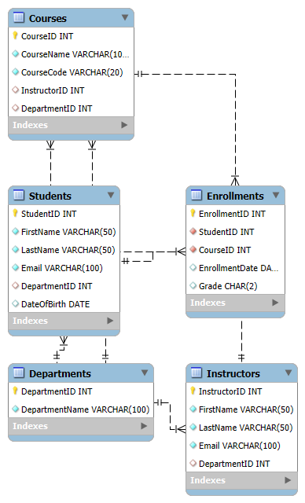

# Student Records Database

## Description
This project is a Student Records Database designed to manage student records, courses, instructors, and enrollments. The database allows administrators to manage departments, students, courses, and instructor assignments. It also tracks student enrollments and grades.

## How to Set Up
1. Download or clone the repository.
2. Open your SQL client (e.g., MySQL Workbench, phpMyAdmin).
3. Create a new database (if not using the `CREATE DATABASE` statement in the SQL file).
4. Copy the contents of `StudentRecordsDB.sql` into your SQL client and run it to set up the database and tables.

## Entity-Relationship Diagram (ERD)
  <!-- OR provide a link to your ERD file -->
